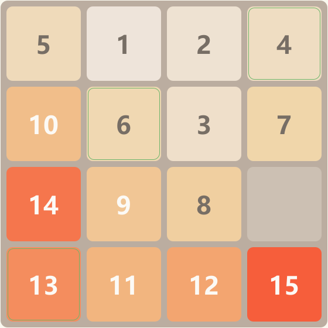
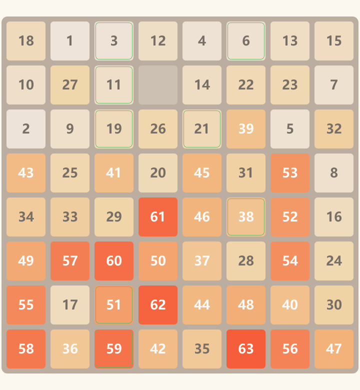

# 数字华容道 · Digital Huarong Dao

> 用 Java Swing 实现的滑动数字拼图（sliding tile puzzle / n-puzzle game），支持 3x3 ~ 8x8、IDA\* 求解器、自动演示与最佳成绩记录。
> A sliding tile puzzle game built with pure Java Swing — 3x3 to 8x8 boards, an IDA\* solver, auto-demo playback, and personal best records.


| 4 x 4 | 8 x 8 |
| --- | --- |
|  |  |

## 特性 Features

- **六档难度**：3x3 简单 ~ 8x8 地狱，打乱算法保证任意局面必定有解。
- **最优求解器**：IDA\*（曼哈顿距离 + 线性冲突启发），3x3 全状态空间经 BFS 逐步核对最优性。
- **提示与自动演示**：4x4 以下走加权 IDA\*（接近最优），5x5 以上用分层归位求解器（模仿人类逐圈归位策略，8x8 也在 50ms 内出解）。演示全程动画播放、可随时中断。
- **滑动动画与操作反馈**：平滑移动动画、正确归位高亮、通关结算层；方向键 / WASD / 鼠标均可操作，`Z` 撤销、`R` 重开。
- **最佳成绩持久化**：各难度独立记录最少步数与最短用时，通关自动保存。

## 运行 Getting Started

需要已安装 JDK 8 或更高版本。

```bat
cd src
javac -encoding UTF-8 *.java
java DigitalHuarongdao
```

或在项目根目录：

```bat
javac -encoding UTF-8 -d out src\*.java
java -cp out DigitalHuarongdao
```

也可以直接双击 `run.bat`。

> 源码为 UTF-8 编码，`-encoding UTF-8` 不能省略，否则在默认 GBK 编码的 Windows 上编译，中文界面文字会乱码。

## 测试 Testing

```bat
javac -encoding UTF-8 -d out src\*.java
java -cp out PuzzleBoardTest
java -cp out RecordStoreTest
java -cp out PuzzleSolverTest
java -cp out LayeredSolverTest
```

全部通过时输出统计并以退出码 0 结束，存在失败时逐条列出并以退出码 1 结束。

- `PuzzleBoardTest` 覆盖棋盘逻辑与逆序奇偶性有解判定；
- `RecordStoreTest` 覆盖成绩的提交、刷新与持久化；
- `PuzzleSolverTest` 对 3x3 全状态空间（181440 个局面）做 BFS，抽样核对 `PuzzleSolver.solve` 求得的解确实最优，并验证快速模式 `solveFast` 在最优求解超预算的难局上也能毫秒级返回有效解；
- `LayeredSolverTest` 验证分层归位求解器在 3x3~8x8 全尺寸随机局面上都能给出可复原的解。

## 打包 Packaging

执行 `build.bat`：编译 → 跑测试 → 打 jar → `jpackage` 生成自带运行时的独立程序（应用图标见 `assets/app.ico`）：

```
dist\DigitalHuarongdao\DigitalHuarongdao.exe
```

双击即可运行，无需目标机器安装 Java。打包机需要 JDK 14+（jpackage）；日常开发继续用 `run.bat` 即可。

## 玩法 How to Play

- 把数字按从小到大排好，空白格在右下角即通关。
- 点击与空白格相邻的数字，或用方向键 / WASD 移动空白格。
- 可选 3x3 ~ 8x8 六档难度。
- `Z` 撤销上一步（局面与步数同步回退），`R` 重新开始。
- 处于正确位置的数字块带绿色描边，方便观察进度。
- `H` 提示一步（黄色高亮），"自动演示"按钮完整通关，`Esc` 或点击棋盘停止演示。
- 提示与演示所有尺寸（3x3~8x8）均可用：4x4 及以下用加权 IDA\* 快速求解（路径接近最优）；5x5 及以上用分层归位求解器 `LayeredSolver`（模仿人类逐圈归位策略，毫秒级完成，路径较长但不保证最短，演示时会自动加速播放）。另提供严格最优的 `PuzzleSolver.solve`（供测试与分析）。
- 本局一旦使用提示或演示，成绩不计入纪录。
- 每个难度分别记录最少步数与最短用时，通关后自动保存到用户目录的 `.digital-huarongdao-records.properties`。
